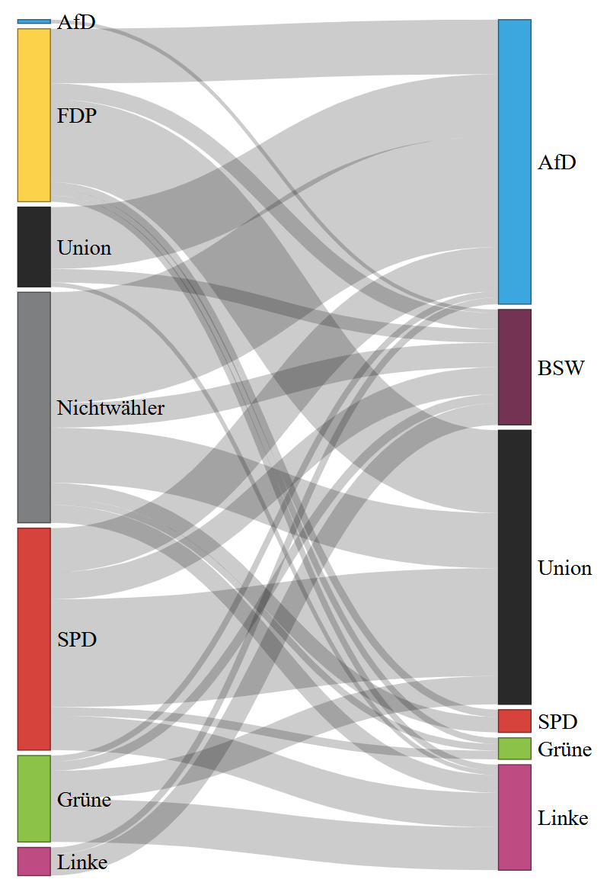

# Wählerwanderung 2025

[**Interaktive Version [hier]**](https://davidbeh.github.io/politikdiagramme/)

Herkunft der Daten:\
[Wie die Wähler wanderten - ARD](https://www.tagesschau.de/wahl/archiv/2025-02-23-BT-DE/analyse-wanderung.shtml)\
Stand: 24.02.2025 01:57 Uhr

TODO:

- [ ] Einfärben der Verbindung je nach politischer Richtung der Wanderung (links/rechts)
- [ ] Weitere Jahre hinzufügen

## Eventuell Geplant:

- [ ] Darstellen von gebliebenen Wählern

## Sonstiges

Mit viel Hilfe von KI erstellt